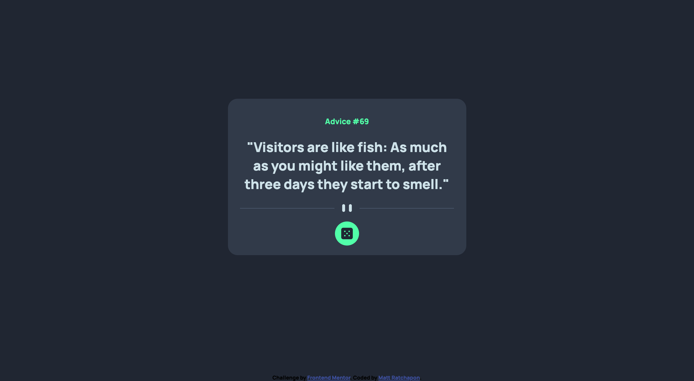
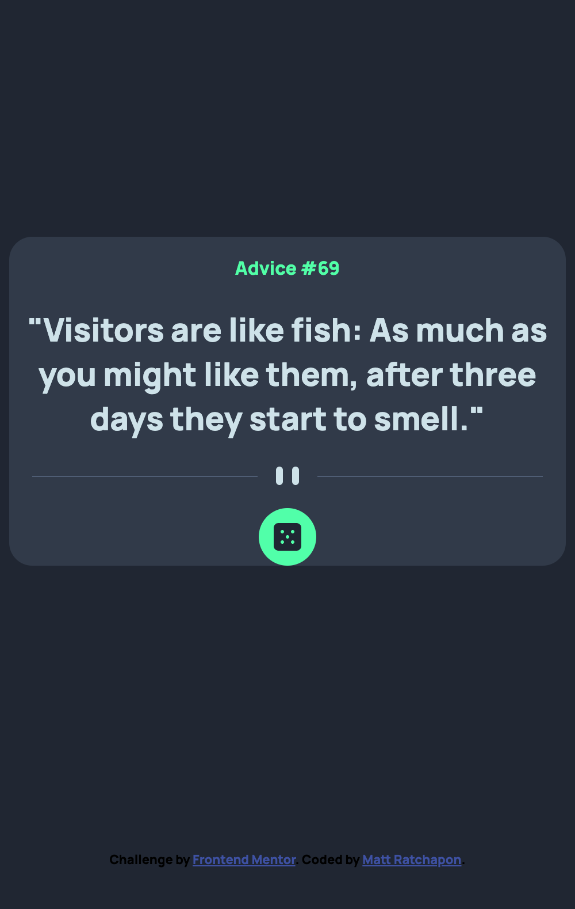

# Frontend Mentor - Advice generator app solution

This is a solution to the [Advice generator app challenge on Frontend Mentor](https://www.frontendmentor.io/challenges/advice-generator-app-QdUG-13db). Frontend Mentor challenges help you improve your coding skills by building realistic projects.

## Table of contents

- [Overview](#overview)
  - [The challenge](#the-challenge)
  - [Screenshot](#screenshot)
  - [Links](#links)
- [My process](#my-process)
  - [Built with](#built-with)
  - [What I learned](#what-i-learned)
  - [Continued development](#continued-development)
  - [Useful resources](#useful-resources)
- [Author](#author)
- [Acknowledgments](#acknowledgments)

## Overview

### The challenge

Users should be able to:

- View the optimal layout for the app depending on their device's screen size
- See hover states for all interactive elements on the page
- Generate a new piece of advice by clicking the dice icon

### Screenshot




### Links

- Solution URL: [Github](https://github.com/bbenbboy/8.-advice-generator-app-main.git)
- Live Site URL: [Live Site URL](https://8-advice-generator-app-main.vercel.app/)

## My process

### Built with

- Semantic HTML5 markup
- CSS custom properties
- Flexbox
- CSS Grid
- Mobile-first workflow

### What I learned

How to set a VH, it's still complicated for me but will keep learning. Also with the API, I'll try to work with this language deeper.

```css
.body {
  height: auto; /* sets the height of the element to half of the viewport height */
  width: 50vh; /* sets the width of the element to half of the viewport height */
  margin: calc(50vh - 25vh) auto;
}
```

```js
const getAdviceData = function () {
  fetch("https://api.adviceslip.com/advice")
    .then((response) => {
      //   console.log(response);
      return response.json();
    })
    .then((adviceData) => {
      //   console.log(adviceData);
      const adviceObject = adviceData.slip;
      //   console.log(adviceObject);
      renderAdvice(adviceObject);
    })
    .catch((err) => {
      console.log(err);
    });
};
getAdviceData();
```

### Continued development

None

### Useful resources

- [Integrate with API](https://youtu.be/2AfzKmgqWUE) - This helped me for understanding how to integrate with this API on this project reason. I liked this pattern and will use it going forward.

## Author

- Website - [My Resume](https://ratchapon-portfolio.notion.site/Hi-welcome-to-my-portfolio-f45d1ec329d54dac9cd9bf8c217a3f01)
- Frontend Mentor - [@bbenbboy](https://www.frontendmentor.io/profile/bbenbboy)

## Acknowledgments

None
